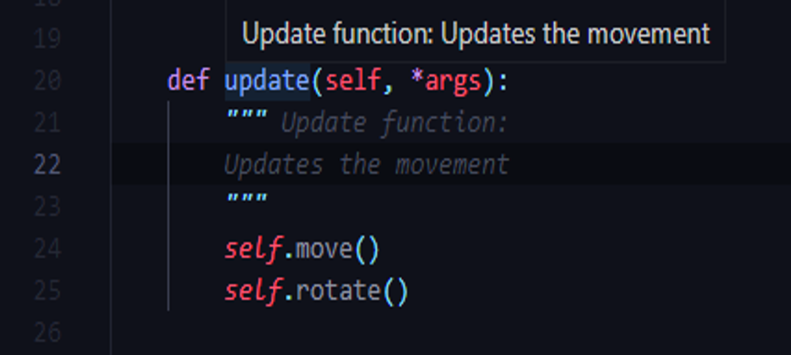

# String

## String
---
### Immutability Principle
String are immutables, and you can't change it.

Look:
```py
>>> w = "word
>>> w[0] = 'l'
...error text omitted...
TypeError: 'str' object does not support item assignment
```

But, you can do:
```py
>>> w = "word"
>>> w = "l" + w[:1]
```

It'll catch the "ord" and add the "l" in the start.

or:
```py
>>> w = "word"
>>> w = w.replace("w", "l")
```
[Return](../Object%20Types.md#--strings)

---

### Working with quotes
+ An issue that happen in python with string operations are the quotes.

If you are using a double quote to delimit the string, you can use a single quote inside the string, but not a double quote. If you are using a single quote do delimit, you'll have the same problems, use the `\'` or just a `"`, but not a `'` into the string. 

```py
>>> print("don't")
don't
>>> print(""Hello, world" - C")
SyntaxError: invalid syntax

>>> print('don't')
SyntaxError: invalid syntax
>>> print('"Hello, world" - C')
"Hello, world" - C
```

To get around this problem, use a `\` before the quote to say that the `"` is into string:
```py
>>> print("\"Hello, world\" - C")
"Hello, world" - C
``` 
[Return](../Object%20Types.md#--strings)

---

### Triple Quotes `"""..."""`
+ These are used to set a string or a comment.
+ It can help you to write a multiple line string or a multiple line comment.
+ For break line in a string, just use `\` instead of `\n`, and go to another line. If you want write two lines in one line, use the \n.

Look:
```py
hello = """ Hello, everyone\
Welcome to my code!
"""

text = """Lorem,\
Ipaum\n is simply dummy text of the printing and typesetting industry.
"""

def function():
    """ Function is a function
    It's to explain the comentary after the structure `def func():`
    """
    pass
```
+ Triple quotes can be used explain a function
+ The first line define the title, and the second line, the explanation



[Return](../Object%20Types.md#--strings)

---

### Concatenate Issue
+ On python you can concatenate a string with another without a add sign - `+`, but you can't concatenate a string with a variable this way.
```py
>>> 'Py' 'thon'
'Python'

>>> prefix = "Py"
>>> prefix 'thon'
  File "<stdin>", line 1
    prefix 'thon'
                ^
SyntaxError: invalid syntax


>>> prefix + 'thon'
'Python'
```
[Return](../Object%20Types.md#--strings)

---

### Selecting characteres by index

## Path
### Working with directories path
+ To determine a path, use the `r` before the path string. It'll avoid to have error with special commands, like `\n` or `\t`.
```py
>>> print('C:\Users\nicholas')
C:\Users

>>> print(r'C:\Users\nicholas')
C:\Users\nicholas
```
[Return](../Object%20Types.md#--strings)

---

